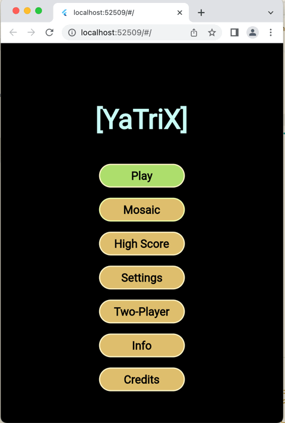

# YaTriX

Yet Another Tetris Clone, made with Flutter and Flame-Engine.

## Getting Started

- Have an installation of Flutter version 3.3.x or later
- Clone this repo.
- flutter pub get
- Run in Chrome:
`flutter run -d Chrome`

Build for deployment:
`flutter build web`

Deploy to web server: copy contents of folder build/web:

## A tiny teaser

Running the game in a local browser

## Online Web Version
You can play the game here:[https://schilken.de/yatrix](https://schilken.de/yatrix)
